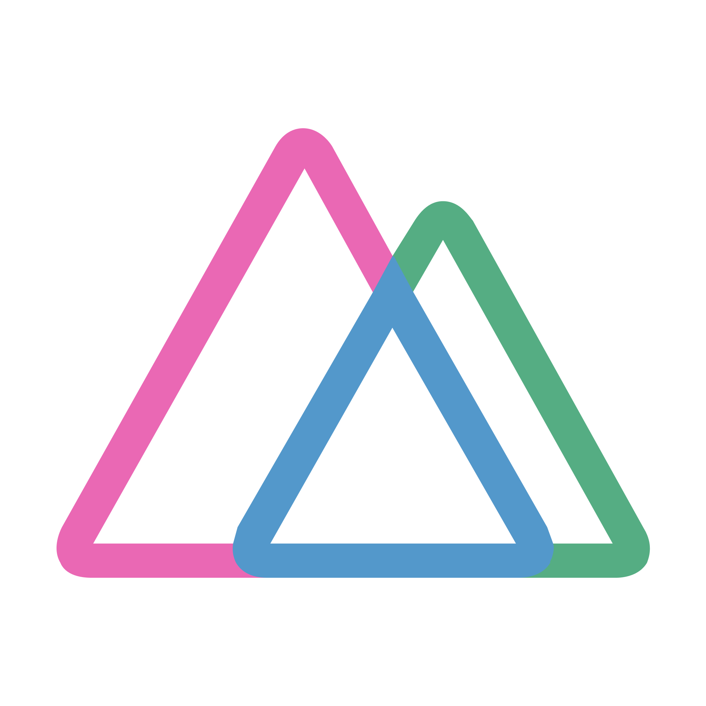

<p align="center">
    <a href="https://webspaceteam.com" target="_blank">
        
    </a>
</p>
<h1 align="center">Electron Nuxt</h1>  
<p align="center">
   by <a href="https://webspaceteam.com" target="_blank">WebspaceTeam</a>
</p>

> Electron application boilerplate based on Nuxt.js for crossplatform desktop application development

Electron Nuxt core components:

+ Electron
+ Electron builder
+ Nuxt.js

Building for Windows NSIS target works perfect. However, there are some tricky moments when you are building for MacOS (both DMG and Mac App Store distribution). See **MacOS** section.

## Build Setup

``` bash
# install dependencies
$ npm run install

# serve with hot reload for Renderer process
$ npm run dev

# build for Windows
$ npm run build:win:64
$ npm run build:win:32
$ npm run build:win:both

# build for MacOS
$ npm run build:mac:dmg
$ npm run build:mac:store
```

## Folders structure

`/build` folder stores icon and additional scripts for Electon Builder

`/mainprocess` includes JavaScript for the Electron main process

`/src` folder structure typical to any Nuxt.JS project 

## MacOS

### Key definitions

+ <a href="https://developer.apple.com/documentation/xcode/notarizing_macos_software_before_distribution" target="_blank">Notarization</a>

+ <a href="https://support.apple.com/en-us/HT204397" target="_blank">App-specific password</a>

+ <a href="https://developer.apple.com/documentation/security/hardened_runtime_entitlements" target="_blank">Hardened Runtime</a>

+ <a href="https://developer.apple.com/documentation/appstoreconnectapi/profiles" target="_blank">Provisioning profile</a>

+ <a href="https://developer.apple.com/documentation/bundleresources/entitlements" target="_blank">Entitlements</a>

+ <a href="https://developer.apple.com/app-sandboxing/" target="_blank">Sandboxing</a>

+ <a href="https://developer.apple.com/library/archive/documentation/Miscellaneous/Reference/EntitlementKeyReference/Chapters/EnablingAppSandbox.html#//apple_ref/doc/uid/TP40011195-CH4-SW1" target="_blank">Security Entitlements List</a>


You need to create provisioning profile at developer.apple.com and place it to `build` folder as `embedded.provisionprofile`. 

### DMG distribution 

To distribute your application as DMG image it should be signed and notarized.

To sign application change `CERTIFICATE NAME (***********)` in `package.json` file in `build:mac:dmg` section to yourth one.

To notarize application change `apple@developer.id` and `application password` in `package.json` file in `build:mac:dmg` section to yourth one.

Additionaly check (add or remove) entitlements at `build/entitlements.mac.plist`

### Mac App Store distribution

> **Attention**: currently only Electron 5.0.13 and 6.1.7 can be publised to Mac App Store. Do not forget to change Electron version in package.json

To publish application at Mac App Store it should be sandboxed and all binaries should be signed. Appropriate entitlements needs to be added.

Steps to prepare your application for publication:

1. Change `CERTIFICATE NAME (***********)` in `package.json` file in `build:mac:store` section to yourth one.
2. Check (add or remove) entitlements at `build/entitlements.mas.plist`. Replace `DEVELOPERID.full.package.name` in `build/entitlements.mas.plist`
3. In `build/resignAndPackage.sh` change `APPLICATION NAME` to your application name (should be as `productName` in `package.json`). Replace `CERTIFICATE NAME (***********)` to your certificate name in two places.
4. Binaries that are listed in `build/resignAndPackage.sh` valid for Electron 5.0.13. Should be updated for another Electron version or in case additional binaries will be used. To find binaries run
`find -H YourAppBundle -print0 | xargs -0 file | grep "Mach-O .*executable"` (see <a href="https://developer.apple.com/library/archive/documentation/Security/Conceptual/AppSandboxDesignGuide/AppSandboxImplementationChecklist/AppSandboxImplementationChecklist.html#//apple_ref/doc/uid/TP40011183-CH8-SW1" target="_blank">source</a>). Binaries from `node_modules` can be unpacked by listing them in `asarUnpack` key in `package.json`.
5. Build `dist/mas/$APP-mac_store.pkg` should be uploaded to Mac App Store via <a href="https://apps.apple.com/us/app/transporter/id1450874784?mt=12" target="_blank">Transporter</a> application


### Knowing issues

+ There is a bug in Electron builder. Only one target for `mac` can be specified.


## Licence
MIT © [Electron Nuxt](https://github.com/webspaceteam/electron-nuxt) by <a href="https://webspaceteam.com" target="_blank"> WebspaceTeam</a>
